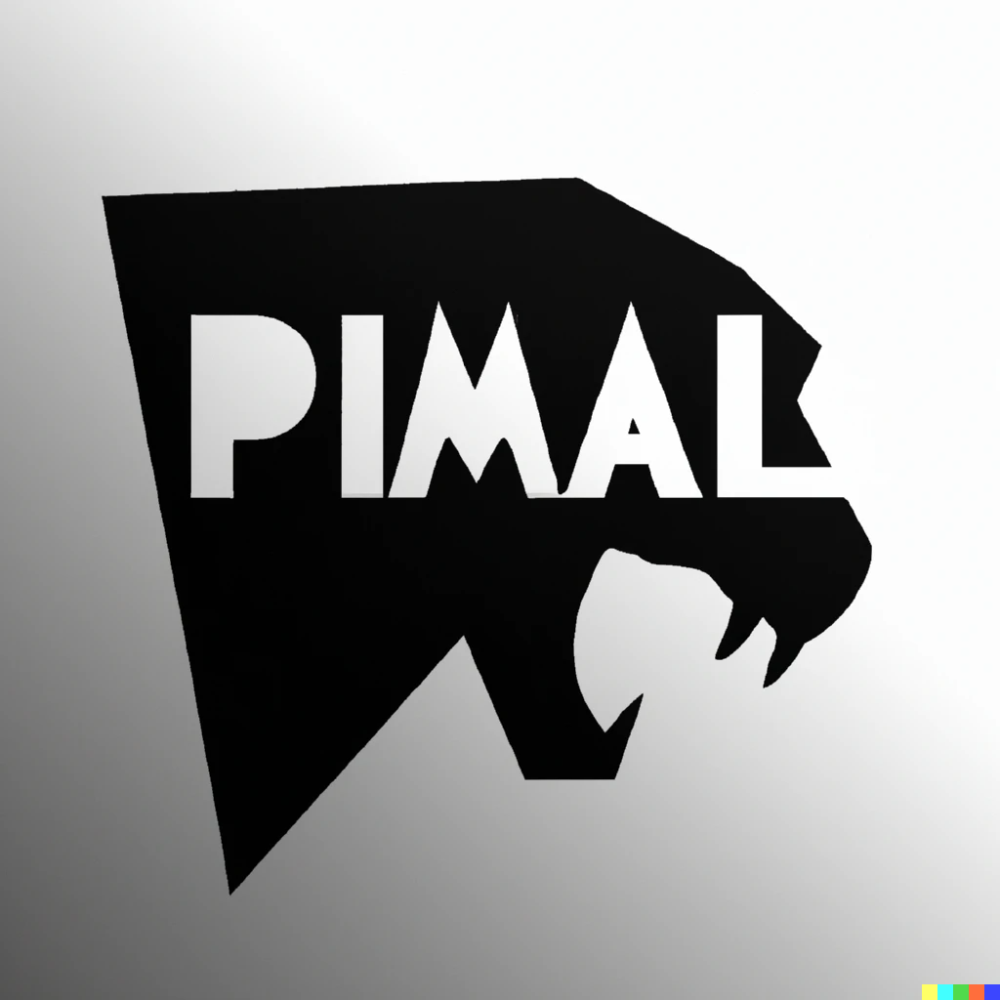

 

<a href="https://github.com/Zorghost/Hextech-Game-Engine/blob/main/LICENSE?">

<!-- PROJECT LOGO -->
 

    

<h3 align="center">Hextech Game Engine</h3>

  

    An open-source C++ game engine for flexible and immersive game development, with robust features and a supportive community.
     
    <a href="https://gitlab.rz.htw-berlin.de/softwareentwicklungsprojekt/sose2022/team9/-/tree/main/"><strong>Explore Docs »</strong></a>
     
     
    <a href="https://github.com/Zorghost/Hextech-Game-Engine/">Repository</a>
    ·
    <a href="https://github.com/Zorghost/Hextech-Game-Engine/issues/new">Report a Bug</a>
    ·
    <a href="https://github.com/Zorghost/Hextech-Game-Engine/issues/new">Request Feature</a>
  

